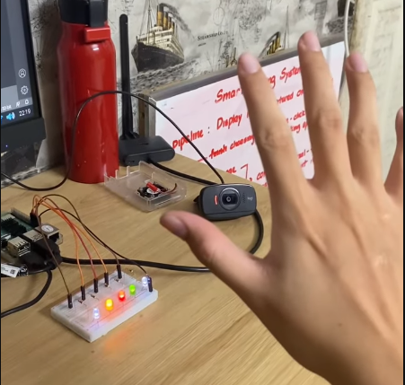

# RPI-Light-Control-Using-Fingers
5 LED lights control by 5 of your fingers in your hand, if any of your fingers is raised, the corresponding LED light will light up, otherwise it will remain off.
  
 This is just a simple project to get used to circus design and image processing of mine. Have fun!
   
 (A small demo will be shown below, please click on the image)
 
 
